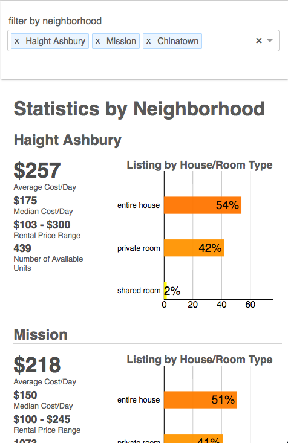

# AirDnG

## About
[AirDnG live][github]
[github]: http://alexandersmanning.github.io/AirDnG

AirDnG provides data visualization of common words and phrases used in AirBnB posts, using the D3 library to create different graphs based on the neighborhood. React, using the Redux framework, to handle storage of data and loading components on addition and removal or different neighborhoods. 

The goal of this project was to provide an interface in which people will be able to better interact with the data, leading to further exploration.

## Features & Implementation

### Force Graph Displaying Common Words By Listing

Through analyzing 8,000+ listings using ruby, I was able to quickly display key words and phrases, removing extraneous words, and break them down by neighborhood. This information was saved in a formatted JSON file to be accessed by the front end.

D3's Force Simulation method was used to connect word nodes to the neighborhoods that used them in their listings. Each word node was sized by the number of mentions of a word between selected neighborhoods, and the neighborhood nodes were sized by the number of listings for that neighborhood. 

### Cost Per Neighborhood

Cost per neighborhood utilized a separate data set, which provided general cost, and room type for each listing. Ruby was used to not only parse the data, but to quickly compute the basic statistics (range, median, standard deviation) for each neighborhood post parse. This data was also saved to a JSON file where it was used for a separate react component.

D3's scale linear and rectangle function was used to create bar graphs for percentage of listings by room type, using the stats stored in the JSON file. D3Tip addon was used to provide a further statistical breakdown by room type, with the main statistics for the neighborhood being displayed by the side of the graph

### Filtering based on Neighborhood

React-Redux greatly helped organize and allow for instantenous re-rendering of data based on the addition and removal of neighborhoods, per the react-select component. With each select change, an action to pull and update information from both graphs is called, which is called by the middleware to then set the appropriate store variables, leading to a re-render. The organization the redux cycle bring allows for me to quickly add new cities without issue.

## Technologies

This project was implemented with the following technologies:

- Ruby for parsing and analyzing incoming CSV data
- React-Redux to control the feed and change of data, and rendering of components
- Vanilla JavaScript/ES6 for organzing data to be consumed by the multiple graphs
- D3js to create the graphs and keys using the the React-Redux store variables
- HTML5 and CSS3 to properly layout the page appropriately for multiple screen sizes
- Webpack to bundle and serve up the various scripts

## Future Directions for the Project

### Multiple Cities and Neighborhoods
It is my goal to add additional cities so that multiple comparisons can be made, along with the possibility of comparing different city keywords with one another

### Additional analysis displaying cost by location
Given the tremendous range in cost/night within the same neighborhood, and between neighborhoods, it is my goal to add further details by area, possibly through adding a map to provide a visual representation or where the most expensive places in the city area, and the least expensive 