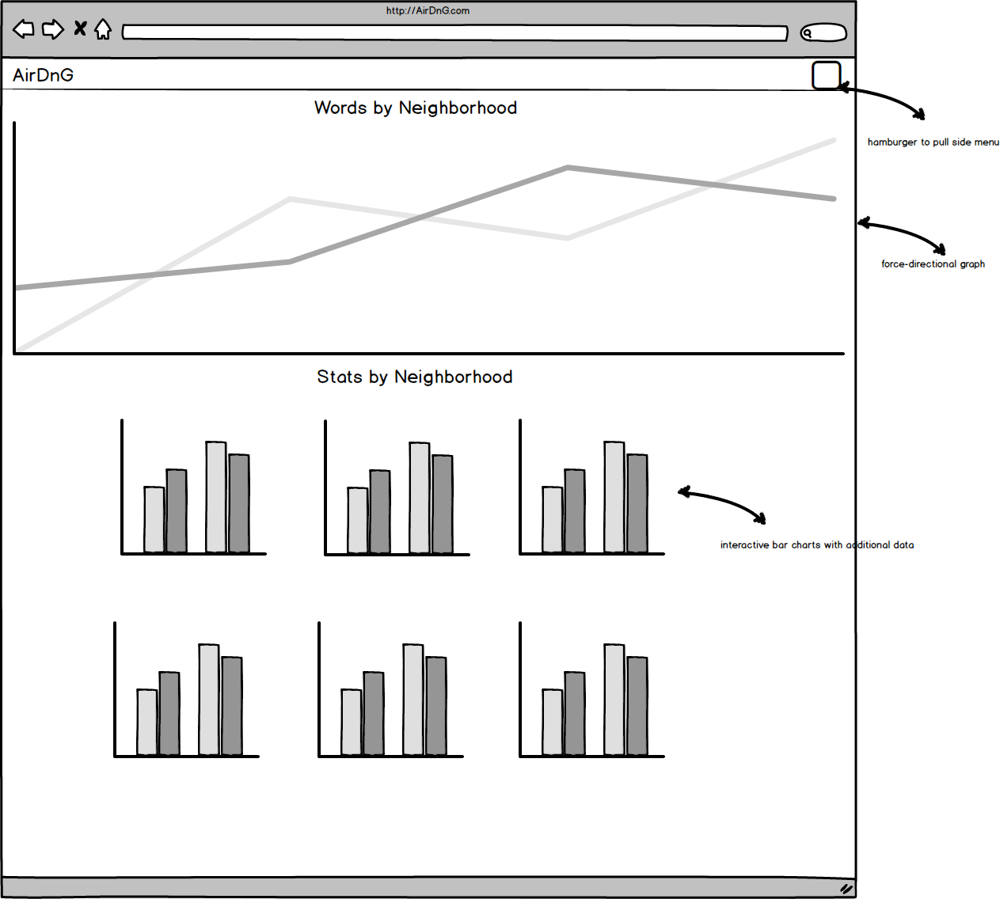
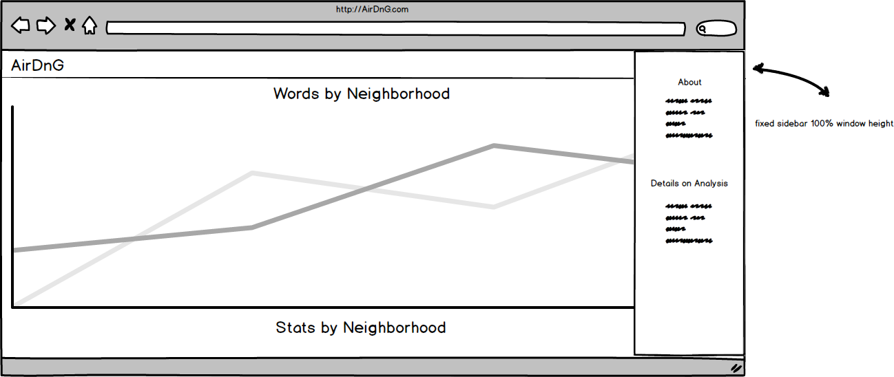

# AirDnG

Using data pulled from AirBnB by http://insideairbnb.com/, I plan to analyze and create a number of graphs based around different findings. The goal is to create a visual representation of the ads, the cost of different areas, and how often they are frequented, to give some insight into AirBnB related tourism in the city

## Background

I gave a somewhat corny name to the project (Air Data and Graphs), but the idea was to see how different neighborhoods are advertisting their rentals, if there are common words or phrases being used (walking distance vs. muni/bart), and the recommended areas for each advertisement. I think in many ways this will an interesting view of each neighborhood. 

Furthermore, I would like to create bar graphs on the cost of each neighborhood vs number of stays. The idea is just to provide a visual overview of what neighborhoods are "worth" to tourists.

Finally, as a bonus, I want to see if I can overlay of of this data on a map to provide another way of visualizing each neighboorhood and the boundaries

## Functionality & MVP

Users will be able to:

1. View common phrases and words used by neighborhood and in general for AirBnB advertisements in SF
2. See price differences (median and average) by neighborhood, in relation to how often they are occupied, and for what length

In addition, this project will include:

1. An About page/modal/sidebar describing the background and links to my work
2. Utilities for analyzing the data and creating JSON documents
3. A production Readme

## Wireframes

This app will consist of a single screen with a main screen that contains multiple interactive graphs and a side bar with more information about the data and myself.

Mainscreen and Sidebar

## Technologies

This project will be implemented with the following technologies:

Vanilla JavaScript for front end
D3 for data visualization
Node for package and front end management
React for the views
Ruby for analyzing and organizing the data
	- descriptive statistics gem
Webpack to bundle and serve up the various scripts.

These will be the different pieces for my project:

1. descriptions_analysis && rental_analysis are two ruby files used for opening the CSV data file, manipulating, and transforming the data into a JSON file, which will be used as the front end
2. NeighborhoodWords class for displaying D3, and possible mainpulations (view by specific neighborhood)
3. NeighborhoodCosts class for displaying D3 bargraphs and possible manipulations for each neighborhood

Implementation Timeline
Day 1: Work on reading a CSV and massaging the data into a usable format

Goals: 

1. Be able to pull the data and get it into a usable format, in which it can be analyzed

Day 2: Finalize pull of data, and begin analysis, finding key phrases and words, and those that must be excluded

Goals:

1. Have a working data pull that cleans the data properly and provided reasonable results

Day 3: Create JSON file and begin working with D3 to graph data

Goals: 

1. Have complete JSON file with clean and ready to use data
2. Have an understanding of D3, and a possible implementation of a proposed graph (hopefully using real data)

Day 4: work on first set of force directed graphs for common words and phrases 

Goals:

1. Have a completed set of force-directed graphs, show appropriate size and interactivity

Day 5: Analyze data set for cost by neightborhood and begin massaging data using ruby's descriptive statistics gem

Goals:

1. Have data analyzed and properly adjusted
2. Have JSON started

Day 6: Complete JSON and analysis for cost by neighborhood and begin working with D3

Goals:

1. Completed data analysis of second piece
2. Working D3 graph using partial data

Day 7: Complete D3 graph for cost by neighborhood and begin styling

Goals:

1. complete interactive graphs by neighborhood 
2. CSS started

Day 8: Complete CSS about sidebar/modal

Goals:

1. Complete CSS and about modal/sidebar
2. Have a complete product with two separate analysis that can be interacted with 

Bonus features

1. Additional analysis based on neightborhoods or general analysis on city
2. Ability to expand to other cities and provide the user the choice to compare